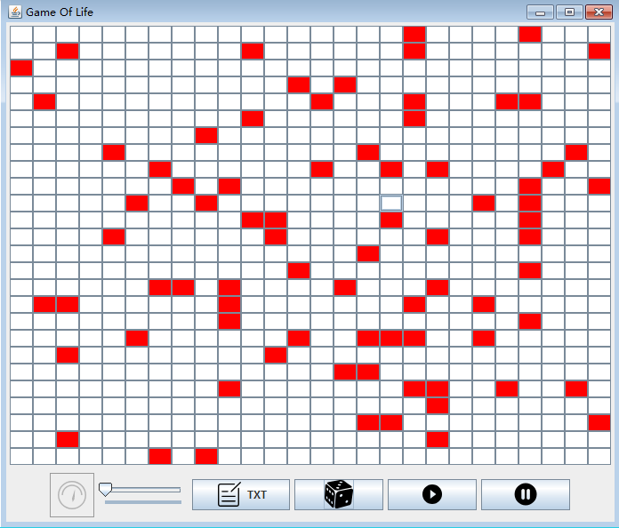
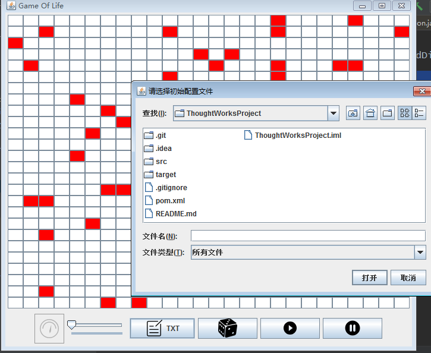
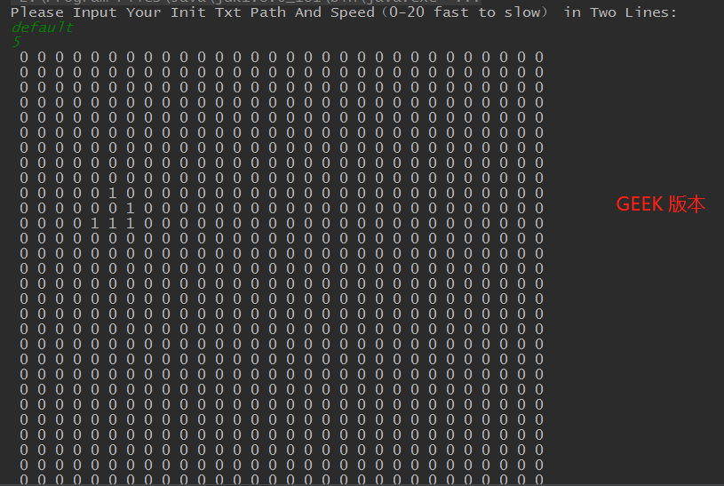

# ThoughtWorksProject
Pair programming practice in thought works

# 需求实现
## 实现Game Of Life 核心逻辑。
1. 构造World类，用来模拟整个cell族群存活的世界。
2. matrix域，存储所有cell的存活状态，0 或 1 表示cell 死亡或者存活
3. 核心函数
    1. generation() 模拟单个cell的存活逻辑。
    2. countNeighbour() 获取单个cell的周围8个方向的细胞存活数量
    3. getCellState() 实现边界判断，获取matrix中对于坐标的cell的存活状态
4. 实现 "开发者模式" 支持控制台控制游戏，记录每次迭代的过程，帮助开发者们更好的理解cell们迭代的每一步过程！

## 实现界面展示游戏
1. 用户UI界面游戏画面，排列工整的Button，与分割统一的UI图标。

2. 用户UI界面读取TXT文件，指定游戏初始状态，用户性好的文件读取入口。

3. 开发者版本（GEEK风格）用户界面展示。黑白配色，适合小规模cell演变。

## 实现预先指定状态
1. 游戏提供用户或开发者指定自己希望的游戏初始状态，通过txt文件，程序会解析对于的txt文件，同时，会对非法的txt文件路径进行修改。如果用户没有输入相应的txt文件路径，或者错误的路径。游戏会读取默认的初始化文件。
2. 游戏还提供随机初始化状态，让用户或开发者能够享受随机游戏的乐趣。

## 实现速度调节
1. 游戏在开发者模式下，开发者可通过数字档位输入，对cell们的迭代速率进行控制。
2. 游戏在用户UI模式下，用户UI可直接通过滑动块，直观的控制cell的迭代速率。

## 代码编程细节
1. 整个开发流程采用TDD模式。由两位同学协作完成。一位负责测试用例编写与开发，一位负责逻辑代码的开发。二者轮换。
2. 整个开发流程采用快速迭代，由原生控制台程序，不断优化与用户的交互逻辑，实现用户指定txt文件路径与相关速率控制。
3. 提升用户使用体验，开发用户UI模式。使用Java Swing开发框架。选择合适的UI图标，整个界面清爽大气、经典难忘。
4. 程序代码结构清楚，采用OOP编程。各个包划分明确。
    1. Display：负责用户UI展示
    2. Entity：World 实体类，负责整个cell世界。
    3. Import：负责用户交互逻辑。
    4. Utils：核心工具类，完成程序中必要功能。
5. 程序注释清楚，可阅读性好。
6. 采用Git协同开发。commit历史完整，详细。
7. 使用maven构建项目，进行jar包管理
8. 使用Junit进行单元测试
9. 测试驱动开发，先写需求测试，验证不通过，实现需求方法，重新跑测试用例，绿灯提交。

## 一些问题
1. 算法使用暴力求解，没有进行优化。
2. 控制速度的设计，在小规模实验下很流畅，但是大规模实验会卡顿，大规模指的是细胞数量巨大，算法运行时间和线程休止时间需要控制。
3. UI界面没有添加按钮用户点击初始化功能，后期完善一下。
4. 速度控制条没有做到实时控制，后期晚上。

## 用户使用手册
1. 用户UImain函数入口：com.thoughtworks.myapp.App.main
2. 开发者模式main函数入口：com.thoughtworks.GameOfLife.Entity.World.main
